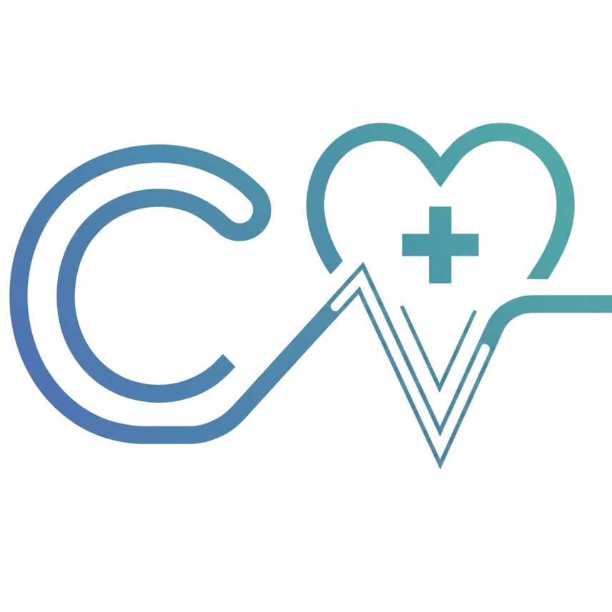

  
  
  # CuraVite
  **Synchronizing the Healthcare Journey.**
  
  
  

---

## ⚕️ About Us
CuraVite is an integrated healthcare platform designed to seamlessly connect patients, physicians, hospitals, diagnostic centers, and insurance companies. By bridging the massive gaps in medical data transfer and physical queue management, we aim to eliminate inefficiencies across the entire healthcare spectrum.

Our mission is to ensure that patients spend less time in waiting rooms, doctors have instant access to accurate medical histories, and diagnostics flow instantly to where they are needed most.

## 🚀 What We're Building

*   **⚡ Smart Queue Management:** Real-time queue status tracking via app, NFC, or QR codes, eliminating overcrowded waiting rooms.
*   **🏥 Integrated Clinical Records:** A unified timeline of health reports, prescriptions, and diagnostics shared securely between patients and authorized providers.
*   **💊 Seamless Prescriptions & Orders:** Direct integrations for pharmacy fulfillment and diagnostic center scheduling.
*   **🛡️ Automated Insurance Claims:** Accelerated workflows to automate trusted insurance claims based on verifiable clinical data.

## 🏗️ Our Architecture

We are building a robust, domain-driven architecture to ensure absolute data integrity and HIPAA-level security. 

*   **Core Database:** Heavily optimized PostgreSQL 18 with inline constraints and static audit trails.
*   **Search & Indexing:** High-performance background indexing powered by Rust.
*   **Services:** *(Add your backend stack here later, e.g., Node.js / Go / Python)*

## 🤝 Open Positions & Collaboration
CuraVite is currently a private venture under active development. Our repositories contain proprietary schemas and architectures.

If you are a team member, please refer to the `CONTRIBUTING.md` file located in this repository for local environment setup instructions, Git workflows, and coding standards.

  © 2026 CuraVite. All rights reserved.

